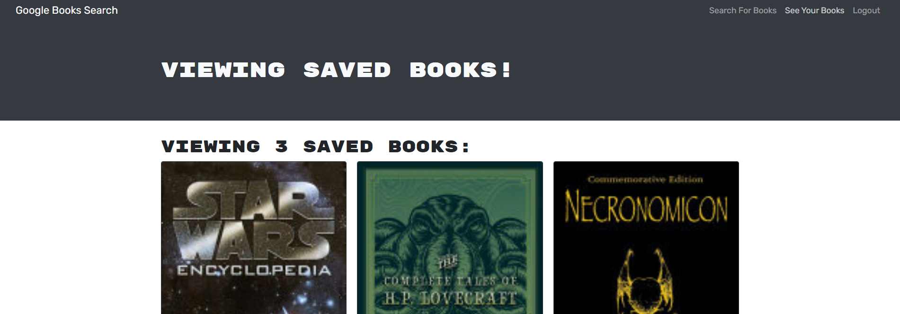

# Dayly-Book-Search

## Description

- My motivation for this project was to create a book search engine that allows users to search for books and save them to their profile for later viewing. This project was a great way to learn how to use GraphQL and Apollo Server to create a back end for a MERN stack application.
- I built this project to use the MERN stack and GraphQL that interacts with an apollo server to create a back end for a book search engine.
- It allows the user to search for books and save them to their profile for later viewing. Using GraphQL and Apollo Server to create a back end for a MERN stack application rather than an express server.
- I learn't how to utilise mutations and queries to interact with the database and how to use GraphQL and Apollo Server to create a back end for a MERN stack application.

## Installation

- To install this project you will need to clone the repository from GitHub and run npm install to install all the dependencies. You will also need to install MongoDB and run the server using npm start. You can then run npm run develop to start the application. You can also visit the deployed application on Heroku at https://dayly-book-search.herokuapp.com/.

## Usage

- To use this project you will need to create an account and login. You can then search for books and save them to your profile for later viewing. You can also delete books from your profile by clicking the delete button. You can also visit the deployed application on Heroku at https://dayly-book-search.herokuapp.com/.

🏆 The previous sections are the bare minimum, and your project will ultimately determine the content of this document. You might also want to consider adding the following sections.

## Badges

Badges aren't necessary, per se, but they demonstrate street cred. Badges let other developers know that you know what you're doing. Check out the badges hosted by [shields.io](https://shields.io/). You may not understand what they all represent now, but you will in time.

